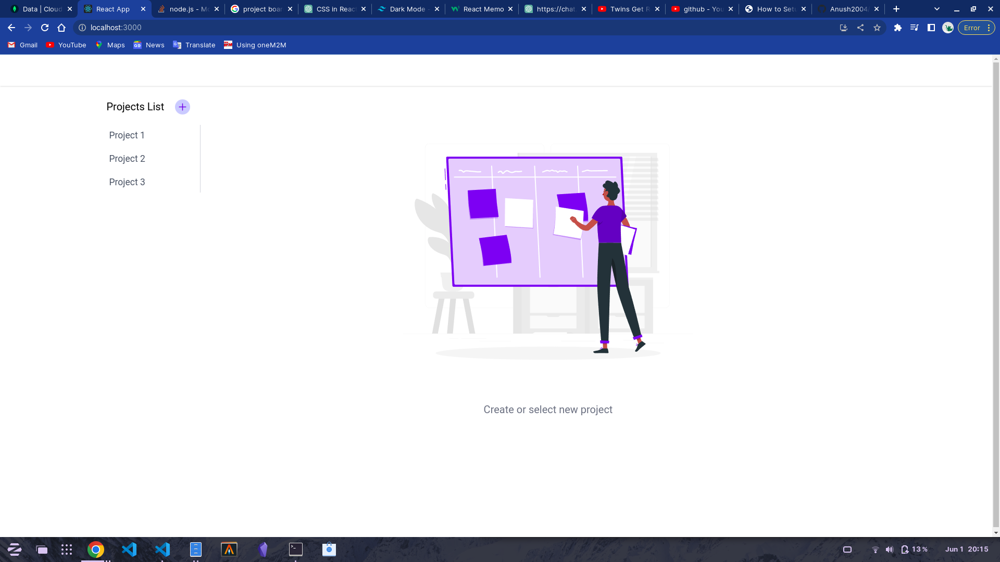
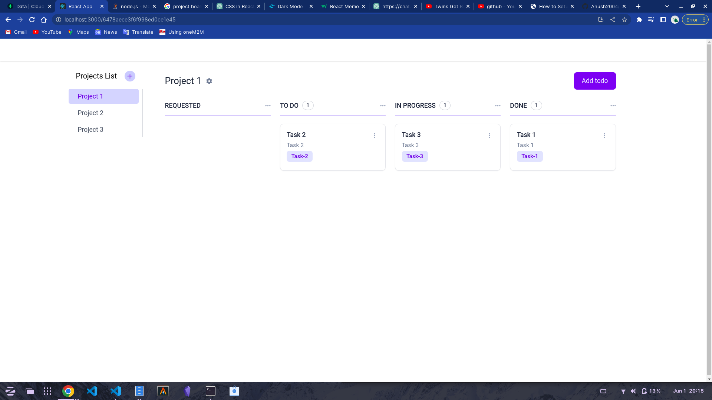

# Task Management Application using the MERN stack (MongoDB, Express.js, React.js, Node.js)

## Setup instruction

- Step 1: install dependencies
  - Go to /backend directory for backend setup and run `npm install`
  - Go to /frontend directory for frontend setup and run `npm install`

- Step 2: Configure mongodb connection url
Go to backend directory and create .env file 
and put into 
`SERVER_PORT=`
`CORS_ORIGIN=`
`MONGODB_PATH=your-mongodb-connection-url`

- Step 3: Run project
in your backend `npm run serve` for start node server and `npm run start` for frontend

## Some ScreenShots

